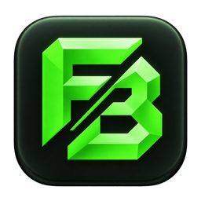
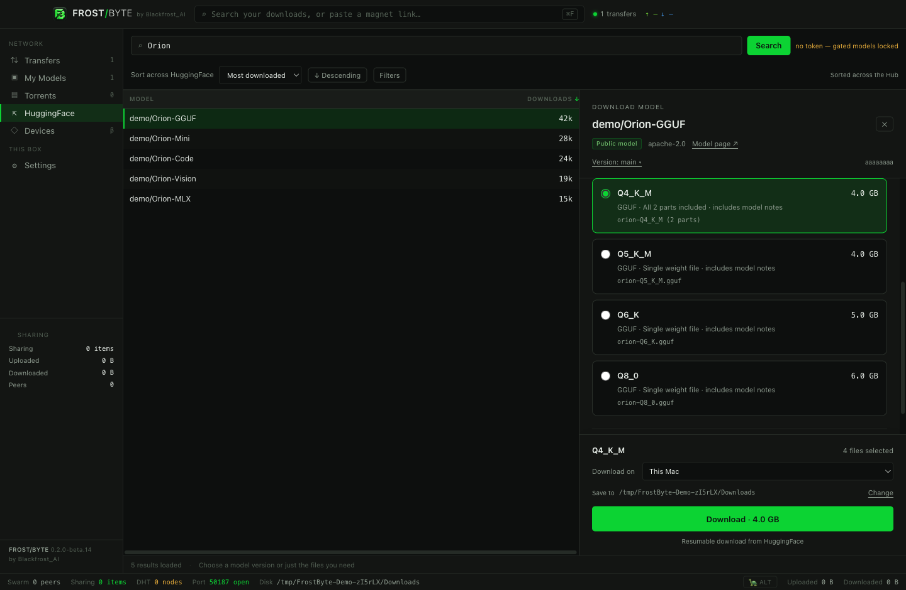
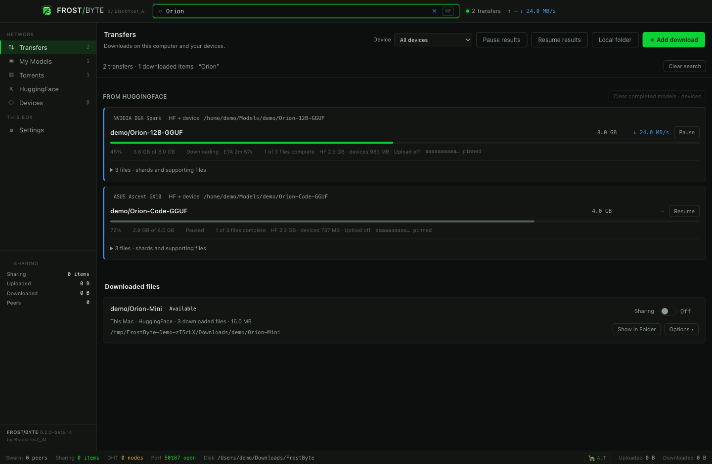
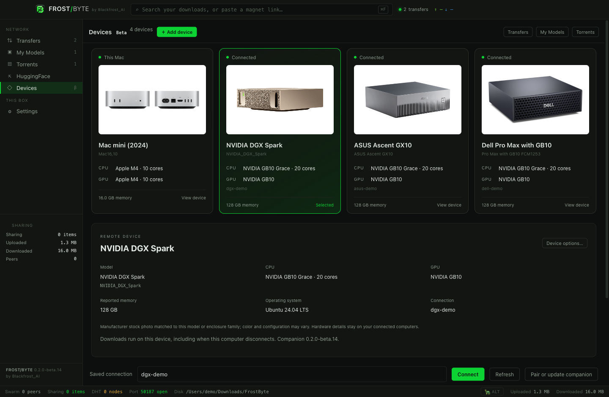

# FrostByte

**The official GitHub home of FrostByte by Blackfrost_AI.**

Hugging Face models, torrents, IPFS collections, and your own devices — in one desktop app. Choose the files you need, choose where they go, and decide what you share.

## Download FrostByte

### [Download for Mac and Windows →](https://blackfrostai.com/frostbyte#get-beta)

Downloads are provided by the official FrostByte website. **The current beta requires an invite code.** The download desk includes installation instructions, signing status, and checksums.

[User guide](https://blackfrostai.com/frostbyte/guide) · [Report a bug](https://github.com/Blackfrost-AI/FrostByte-App/issues/new?template=01-bug-report.yml) · [Request a feature](https://github.com/Blackfrost-AI/FrostByte-App/issues/new?template=02-feature-request.yml) · [Browse feedback](https://github.com/Blackfrost-AI/FrostByte-App/issues)

**Find FrostByte useful? Star this repository** to bookmark the app and show your support. Follow [Blackfrost_AI on GitHub](https://github.com/Blackfrost-AI) and [@blackfrost_ai on X](https://x.com/blackfrost_ai) for news. Need private help? [support@blackfrostai.com](mailto:support@blackfrostai.com).

This is FrostByte’s public product and community page: download links, documentation, and feedback in Issues. FrostByte is proprietary private-beta software; application source is maintained separately. Installers are supplied through the website, with third-party licenses preserved.

## Start here

| You want to… | Go to… |
| --- | --- |
| Report something broken | [Bug report](https://github.com/Blackfrost-AI/FrostByte-App/issues/new?template=01-bug-report.yml) |
| Request an improvement or new capability | [Feature request](https://github.com/Blackfrost-AI/FrostByte-App/issues/new?template=02-feature-request.yml) |
| Fix confusing instructions or report a broken help link | [Documentation feedback](https://github.com/Blackfrost-AI/FrostByte-App/issues/new?template=03-documentation.yml) |
| Ask how something works | [Question or setup help](https://github.com/Blackfrost-AI/FrostByte-App/issues/new?template=04-question.yml) |
| Discuss an existing report | Search [open and closed issues](https://github.com/Blackfrost-AI/FrostByte-App/issues?q=is%3Aissue), then add useful details or a 👍 reaction |
| Report a suspected security vulnerability privately | [Private security reporting](https://github.com/Blackfrost-AI/FrostByte-App/security/advisories/new) — read [SECURITY.md](SECURITY.md) |
| Get help with an invite or another private matter | Use **Help → Send feedback** in the app, or [contact support](mailto:support@blackfrostai.com) |

**GitHub issues, comments, and attachments are public.** Keep invite codes, access tokens, passwords, SSH keys, personal file paths, device addresses, and private download history out of reports. You do not need to identify what you downloaded to ask for help. See [reporting privately](SUPPORT.md#public-and-private-feedback) for alternatives.

## What FrostByte does

### Find models and choose the right files

Search Hugging Face in its own tab. Sort and filter results, review a repository revision, and choose a model format or only the supporting files you need. Split model weights are presented together, so selecting a version includes its related parts. You can also use the custom file picker for configs, tokenizers, documentation, and other selected files.

FrostByte uses the Hugging Face API directly; installing the HF CLI is not required. Restricted repositories still require the appropriate Hugging Face account access and token.

### Follow transfers and find completed downloads

**Transfers** is the starting point. Model shards and supporting files stay together in one expandable card, with combined progress and controls. Torrent downloads appear alongside them.

Use the top bar or **Cmd/Ctrl+F** to search transfers and recorded inventory by model, file name, folder, or device. Press **Enter** to search from another tab. Completed files remain searchable after clearing transfer history. Offline devices retain their last known inventory and show their connection state.

The top bar searches your recorded downloads. Hugging Face has a separate online search. A public community torrent index is a future phase.

### Download on the device and drive you choose

Keep several Mac and DGX companions connected together. Each device has its own inventory, transfer controls, and remembered destination. Choose **one device and one folder for each download**, including a mounted external drive. Selecting another device or browsing another folder does not move an existing job.

Device cards show the reported machine model, CPU, GPU, and memory. Stock images identify supported device families; Windows uses a representative laptop or desktop image alongside the actual reported hardware details.

These are packaged beta.14 screenshots from an isolated demo profile. Hub listings, device connections, and remote progress are simulated. Displayed speeds and capacities are illustrative, not benchmarks. Manufacturer images and marks identify the hardware shown and do not imply endorsement. [Image provenance](assets/README.md).

### Use torrents and control sharing

Open or drag in a `.torrent` file or magnet link, review the contents, and choose the files and destination before starting. Models, configs, updates, documents, videos, software, and archives can all be handled through BitTorrent.

Downloaded models appear in **My Models**; other downloaded files appear in **Torrents**. Each item's sharing controls let you decide whether to offer it to peers. While sharing, the app shows upload activity and bandwidth information. Share only files you are authorized to distribute.

For eligible public Hugging Face downloads, **HF + device** can combine HF with exact, verified files already shared on one selected companion. This beta does not pool several companions into one hybrid download. Availability and speed depend on the sources, network, and storage.

### New in beta.16: IPFS and AEON Orbit

Paste or drop an IPFS link or CID, preview its files, and select one destination.
Each collection stays grouped in **Transfers** and appears in **My Models** or
**Torrents** when complete. Turn Sharing on explicitly to publish its selected
files and copy an IPFS link. IPFS sharing starts off again after restart.

IPFS caches use extra space on the app or companion state drive. Its bandwidth
is separate from torrent limits. This beta does not combine HF, BitTorrent and
IPFS blocks into one download. [IPFS walkthrough](https://blackfrostai.com/frostbyte/guide#ipfs).

**AEON Orbit** is a purple/cyan space theme available to everyone under
**Settings → Interface → Appearance**. Compatible connected Raspberry Pi devices
can expose AEON console tools under their own device card, with AEON’s own
browser authentication. The theme grants no device access. The combined Pi
image remains paused and is not included in this desktop release.
[See the AEON interface](https://blackfrostai.com/frostbyte/guide#aeon); its Pi
connection pictures are clearly labeled demonstrations.

Beta.16 also includes the beta.15 security, native confirmation, grouped resume
and recovery improvements. Optional diagnostics remain off by default, and the
updated app and website notices describe IPFS networking and storage.

## Install and get started

The navigation described here follows **0.2.0-beta.16**. Check the [official download desk](https://blackfrostai.com/frostbyte#get-beta) for the current build, supported targets, signing status, and installation instructions.

| Role | Current beta support | What to know |
| --- | --- | --- |
| Desktop app on Mac | Apple silicon / ARM64 | DMG and app ZIP are distributed through the invite-protected website. |
| Desktop app on Windows | Windows x64 | Per-user setup EXE and app ZIP are available. Setup preserves existing torrent/magnet defaults. |
| Optional remote Mac | Apple silicon or Intel | Requires SSH / Remote Login, Python 3, and an awake Mac with the companion account logged in. No Docker or Frigid is required. |
| Optional remote DGX device | Supported Linux ARM64 or x64 host | Requires SSH, Python 3, and Docker usable by the companion account. |

The documented beta is ad-hoc signed and not notarized on Mac; Windows packages are unsigned. Review the installation notice before downloading. Intel Mac and Windows ARM64 **desktop installers** are not part of this beta. A remote companion's platform support is separate from the desktop installer targets.

1. Get your invited build from [blackfrostai.com/frostbyte](https://blackfrostai.com/frostbyte#get-beta).
2. Install it and review the first-launch beta terms. Optional diagnostics are a separate choice and start off.
3. Start with a small download: use **HuggingFace**, **Transfers → Add download** for a torrent or magnet, or **Transfers → IPFS** for a CID.
4. Review the file selection and choose one destination. To use a remote computer, add it through **Devices** first.
5. Follow progress in **Transfers**. Look for completed files in **My Models** or **Torrents**.
6. Choose whether to share an item. Use **Settings → Updates → Check now** to check for a newer release; installation remains your choice.

The [illustrated user guide](https://blackfrostai.com/frostbyte/guide) covers file selection, external storage, companion setup, bandwidth, sharing, installation, and troubleshooting in detail. [SUPPORT.md](SUPPORT.md) has quick answers for common situations.

## Send a useful report

A short, clear report is more useful than a large unfiltered log. Please search existing issues first and keep each report focused on one problem.

For a bug, include:

- **App version and platform.** Find the version in Settings → Updates. If the app cannot open, say so.
- **What you tried.** A few steps, or the circumstances if the problem is intermittent.
- **What happened and what you expected.** Include the visible error wording when it is safe to share.
- **Relevant context only.** For example, local versus companion download, internal versus external storage, file format, or number of shards. Hardware model and OS version can help with device problems; serial numbers and network addresses are unnecessary.
- **Optional evidence.** A cropped screenshot or short, redacted excerpt can help. Review every attachment before posting.

You can report an intermittent problem even if you cannot reproduce it every time. You do not have to enable diagnostics or upload logs to submit an issue. A small example using files you are allowed to share is welcome when it helps explain the problem; do not upload model weights, installers, or private files here.

For a feature request, describe the task you are trying to complete, the current obstacle, and what a useful result would look like. Concrete workflows and accessibility needs help us make better decisions.

See [CONTRIBUTING.md](CONTRIBUTING.md) for examples and how reports are handled.

## Follow progress

New form submissions start with **status:triage**. Maintainers add area and platform labels as they review them.

| Status | Meaning |
| --- | --- |
| `status:triage` | The report is waiting for an initial review. |
| `status:needs-info` | More details are needed to understand or reproduce it. |
| `status:confirmed` | The problem has been reproduced or otherwise verified. |
| `status:planned` | Work has been selected; this is not a delivery date. |
| `status:in-progress` | Work is underway. |
| `status:released` | A fix or improvement is available in an identified release. |

Issue closure can also mean duplicate, answered, or outside the current scope; read the closing comment for context. A closed issue by itself does not mean that a fix has shipped. Subscribe to individual issues you care about, and add details to an existing report rather than posting duplicates.

We prioritize impact, reliability, accessibility, and the information available to investigate. Reports and votes help guide that work; they are not delivery commitments or a guaranteed response time.

## Where FrostByte is headed

The current focus is reliable downloads, useful inventory, and people hosting files on their own machines. The next product direction is a community directory for legally redistributed open models, with provenance, license information, and explicit publishing controls.

That public index is **not available in the current beta**. Enabling sharing or posting feedback here does not submit your inventory to a directory. Read the [public roadmap](ROADMAP.md) and use feature requests to help shape the work.

## Privacy, conduct, and project status

Optional in-app diagnostics focus on app and connection health and exclude search terms, model names, filenames, file contents, paths, torrent hashes, and credentials. Hardware details are not included in those reports. Manual feedback contains what you review and choose to send. GitHub submissions are a separate, public channel subject to GitHub's own service and privacy practices.

Please follow the [community guidelines](CODE_OF_CONDUCT.md). For a suspected vulnerability, use [private security reporting](SECURITY.md). For invite access or another private support matter, [contact support](mailto:support@blackfrostai.com) without sending your invite code or credentials.

FrostByte remains proprietary private-beta software. This public product repository does not grant access to application source or change the app's license. Third-party components retain their respective licenses. The official [beta terms](https://blackfrostai.com/frostbyte/terms) and [privacy notice](https://blackfrostai.com/frostbyte/privacy) describe the current app and service policies.

---

**FrostByte by Blackfrost_AI** · [Follow on GitHub](https://github.com/Blackfrost-AI) · [Follow on X](https://x.com/blackfrost_ai) · [Website](https://blackfrostai.com/frostbyte) · [User guide](https://blackfrostai.com/frostbyte/guide) · [Support](SUPPORT.md) · [Roadmap](ROADMAP.md)
